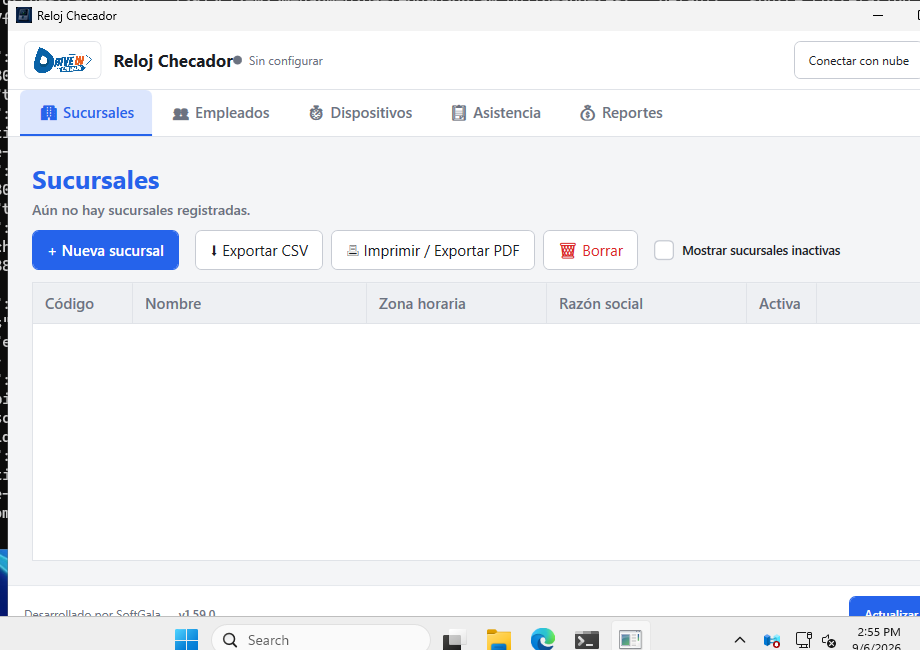

# Reloj Checador

Software de escritorio para Windows que administra relojes checadores biométricos,
empleados, sucursales, asistencia y nómina, con sincronización a Supabase y operación
offline-first. Proyecto para un carwash en Mexicali, B.C., México — una sola empresa,
varias sucursales (single-tenant).

## Vista previa de la interfaz

Captura real tomada en un runner de Windows durante el CI (ver
`.github/workflows/`, paso "Capturar pantalla de la app") — no es un mockup.
Hoy solo existe esta pantalla mínima (Sucursales + Dispositivos); la
navegación completa del diseño visual es la Fase 3, todavía pendiente.



## Stack

- **.NET 10 LTS** / C#
- **WPF + MVVM** (CommunityToolkit.Mvvm), Generic Host para inyección de dependencias
- **EF Core + SQLite** como base local de cada instalación
- **Supabase** (PostgreSQL + Auth) como plataforma central — proyecto dedicado
  `reloj-checador-carwash`, esquema y sincronización push-only ya conectados (ver
  `src/RelojChecador.Infrastructure.Cloud/README.md`)
- **Serilog** para logging estructurado
- **xUnit** para pruebas unitarias/integración
- **Dashboard web** (`dashboard/`): sitio estático HTML/CSS/JS sin build, desplegado en
  Netlify, lee reportes directo de Supabase — ver `dashboard/README.md`

## Estructura

```
src/RelojChecador.Domain/               Entidades y reglas de negocio, sin dependencias externas
src/RelojChecador.Application/          Casos de uso, contratos (IAttendanceDeviceAdapter, repositorios), Result/Error
src/RelojChecador.Infrastructure.Data/  EF Core + SQLite, repositorios, migraciones
src/RelojChecador.Infrastructure.Devices/ Adaptadores de dispositivos (Simulator + ZKTecoDeviceAdapter real)
src/RelojChecador.Infrastructure.Cloud/ Motor de sincronización push-only con Supabase (ver su propio README)
src/RelojChecador.Infrastructure.Security/ Windows Credential Manager (solo compila en Windows)
src/RelojChecador.Infrastructure.Logging/ Configuración de Serilog
src/RelojChecador.WPF/                  Aplicación de escritorio (composition root, ViewModels, Views)
tests/                                  Pruebas unitarias/integración por capa
tools/RelojChecador.DeviceSimulator/    Simulador standalone del protocolo del reloj (pendiente de contenido)
installer/                              Script de Inno Setup + guía para generar el instalador de Windows
supabase/                               Migraciones SQL versionadas (ya aplicadas al proyecto real); Edge Functions pendiente
dashboard/                              Sitio estático (HTML/CSS/JS) de reportes, desplegado en Netlify — ver su propio README
```

## Compilar y probar

```bash
dotnet build
dotnet test
```

> **Nota de entorno**: este proyecto se ha desarrollado desde macOS. Todo excepto la UI
> compila y se prueba de forma nativa multiplataforma. El proyecto `RelojChecador.WPF`
> (y `Infrastructure.Security`) **compilan** también desde macOS/Linux gracias a
> `EnableWindowsTargeting`, pero **solo se pueden ejecutar y verificar visualmente en
> Windows real**. Se ha verificado que `dotnet publish -r win-x86 --self-contained`
> genera un `.exe` de Windows válido incluso compilando desde macOS. Es `win-x86`
> (32 bits), no `win-x64`, porque el SDK real de ZKTeco (`zkemkeeper.dll`, ver
> `third-party/zkteco-sdk/README.md`) es un COM server de 32 bits.

## Generar el instalador de Windows

Ver [`installer/README.md`](installer/README.md). Requiere ejecutarse en Windows con
Inno Setup instalado — no es posible compilarlo desde macOS/Linux.

## Estado del proyecto (Fase 4 — producto mínimo funcional)

**Hecho:**
- Arquitectura Clean/Onion con 12 proyectos y referencias correctas entre capas
- Entidades de dominio: `Branch`, `Employee`, `Device`, `EmployeeDeviceMapping`, `User`
- Contrato `IAttendanceDeviceAdapter` + patrón `Result`/`Error` + `SimulatorDeviceAdapter`
  (datos de prueba) y `ZKTecoDeviceAdapter` real (COM tardío contra `zkemkeeper.dll` —
  ver `third-party/zkteco-sdk/README.md`; probado en construcción contra el F22/ID de
  campo, pendiente de confirmación final en Windows real) con monitoreo en tiempo real
  por sondeo (la asistencia aparece sola en la pantalla de Dispositivos, no requiere
  presionar "Descargar")
- Base local SQLite con EF Core: DbContext, configuraciones, migración inicial, repositorios
- Composition root real del WPF (Generic Host, DI, Serilog, migraciones automáticas al
  iniciar, manejo global de excepciones no controladas, primera pantalla que lee de la
  base local)
- Instalador (Inno Setup), compilado y probado en Windows real vía CI — publica como
  `win-x86` (32 bits, requerido por `zkemkeeper.dll`) y registra el SDK de ZKTeco como
  servidor COM al instalar
- Entidad `Attendance` (persistencia local real de las marcaciones, con deduplicación
  respaldada por un índice único — antes se perdían al cerrar la app) + repositorio
  `IEmployeeDeviceMappingRepository`
- Motor de sincronización push-only con Supabase (proyecto dedicado
  `reloj-checador-carwash`): esquema con RLS aplicado y verificado (lectura solo para
  usuarios autenticados, escritura solo desde la app de escritorio vía `service_role`),
  sincronización incremental de asistencias por cursor, tablas chicas completas en cada
  ciclo, offline-first (nunca tumba la app sin internet) — **confirmada funcionando en
  hardware real** (indicador "Nube: conectado" en la barra superior, punto verde/rojo
  según estado, botón "Conectar con nube" para forzar un ciclo, sincroniza cada 5s) — ver
  `src/RelojChecador.Infrastructure.Cloud/README.md` para cómo activarla en una instalación
- `ZKTecoDeviceAdapter` **confirmado contra hardware real** (F22/ID de campo) en Windows:
  ProgID correcto (`zkemkeeper.ZKEM`), descarga de asistencias vía
  `SSR_GetGeneralLogData` + `ReadAllGLogData` (parámetros `ref` como `object` genérico),
  registro de éxito/fallo de cada intento de conexión para reflejar el estado real
- Módulo de auto-actualización vía GitHub Releases
  (`RelojChecador.Infrastructure.Updates`): consulta la última release del repo público,
  compara contra la versión del ensamblado, descarga el instalador con progreso y lo
  lanza — botón "Actualizar versión" en la barra inferior de la app
- Modo oscuro en la app de escritorio (barra superior) y en el Dashboard
- Panel de usuarios del Dashboard (invitar/quitar acceso), mostrando nombre en vez de
  correo — ver `dashboard/README.md`
- Pantalla de Empleados: alta, edición y listado — mismo patrón MVVM que
  Sucursales/Dispositivos, tramo principal de la Fase 3 (navegación completa de la UI). El
  alta permite vincular a un reloj checador (dispositivo + PIN) en el mismo formulario, sin
  paso aparte
- Vincular Empleado↔Dispositivo (`EmployeeDeviceMapping`): desde la pantalla de Empleados,
  botón "Vincular a dispositivo" por fila (PIN capturado a mano, no descargado del
  dispositivo — ver decisión de alcance en `EmployeesViewModel`); columna "Dispositivos
  vinculados" muestra el resumen. Prerequisito de una futura pantalla de Asistencia que
  muestre nombres en vez de PINs crudos
- Motor de sincronización: cada tabla se sube de forma aislada (un fallo puntual en una no
  bloquea a las demás en el mismo ciclo — antes si podía pasar) y la pantalla de Empleados
  recarga la lista completa desde la base local tras cada alta/edición/vínculo en vez de
  mutar la vista a mano, para eliminar de raíz un caso real donde el DataGrid no reflejaba
  una fila recién guardada hasta reiniciar la app (el dato en sí nunca se perdía)
- Pantalla de Asistencia: consulta las marcaciones ya guardadas localmente (filtros de
  sucursal, rango de fechas y texto libre), con nombre de empleado resuelto — mismo
  criterio de resolución que ya usaba el Dashboard web (`Attendance.EmployeeId` directo, o
  si no hay, `EmployeeDeviceMapping` por dispositivo+PIN). Al crear un vínculo
  Empleado↔Dispositivo ahora se concilian retroactivamente las marcaciones de ese
  dispositivo+PIN que hubieran llegado antes (usa `Attendance.ReconcileEmployee`, ya
  existía en el dominio sin que nada lo invocara). Última pantalla del menú de Fase 3;
  Reportes queda para Fases 5-6

**Pendiente (bloqueado por decisiones o datos externos):**
- Confirmar el login real del Dashboard (requiere que el usuario cree su primera cuenta
  en Supabase Auth — ver `dashboard/README.md` — algo que, por diseño, nunca se hace
  automáticamente desde aquí)
- Navegación completa de la UI (Fase 3 del diseño visual — Sucursales, Empleados,
  Dispositivos y Asistencia ya existen; falta el resto de secciones finales) — **en curso**
- Eliminar empleados, y exportar CSV desde la app de escritorio (el Dashboard web ya lo
  tiene) — mejoras pendientes, no bloquean nada
- Reportes, auditoría, incidencias, nómina (Fases 5-6)
- Razón social real y logotipo/icono para el instalador y la app

## Convenciones

- Cada tarea completada se compila y prueba antes del siguiente paso (`dotnet build` +
  `dotnet test` en verde) y queda en un commit propio con su justificación.
- Nunca se inventan comandos/protocolos de fabricantes de dispositivos ni reglas fiscales
  sin confirmarlas explícitamente.
